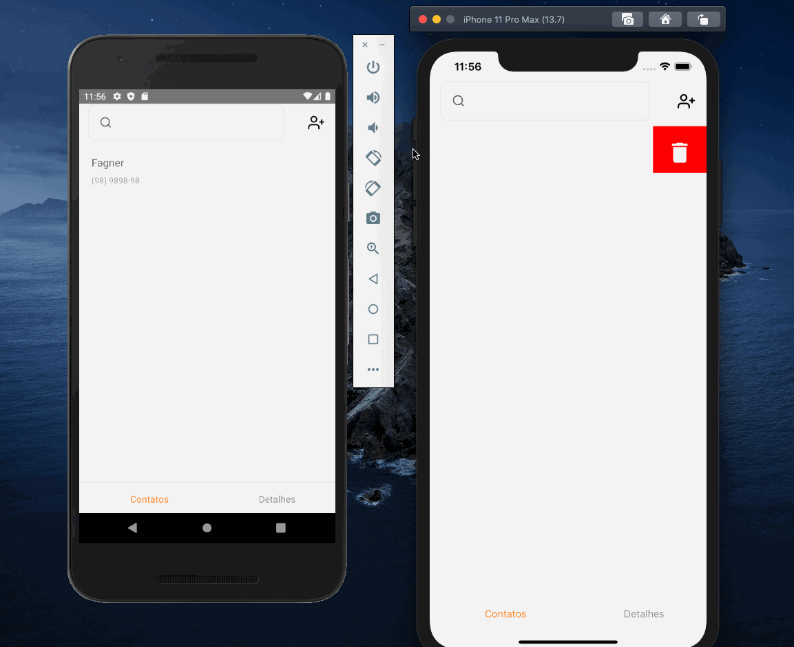

  <h1 align="center">
    
    </br>
    Davinti PhoneBook
  </h1>

<h3 align="center">
  Projeto de agenda telefônica.
</h3>

Desenvolvido por:

- [Fagner Gomes](https://github.com/fagner3g)

<p align="center">
  <a href="#funcionalidades">Funcionalidades</a>&nbsp;&nbsp;&nbsp;|&nbsp;&nbsp;&nbsp;
  <a href="#heavy_check_mark-configurações-necessárias">Configurações necessárias</a>&nbsp;&nbsp;&nbsp;|&nbsp;&nbsp;&nbsp;
  <a href="#arrow_down_small-clonando-o-repositório">Clonando o repositório</a>&nbsp;&nbsp;&nbsp;|&nbsp;&nbsp;&nbsp;
  <a href="#beginner-iniciando-a-aplicação">Iniciando a aplicação</a>&nbsp;&nbsp;&nbsp;|&nbsp;&nbsp;&nbsp;
  <a href="#wrench-tecnologias--ferramentas--recursos">Tecnologias | Ferramentas | Recursos</a>&nbsp;&nbsp;&nbsp;|&nbsp;&nbsp;&nbsp;
  <a href="#memo-license">Licença</a>
</p>

### Funcionalidades

- Cadastro de novo contato
- Cadastro de novos telefones para contato
- Editar contato
- Deletar contato
- Pesquisar contato
- Pesquisar telefone

### :heavy_check_mark: Configurações necessárias

Seguem as configurações neessárias para visualizar a aplicação em sua máquina.

- [Git](https://git-scm.com).
- [Node](https://nodejs.org/).
- [Yarn](https://yarnpkg.com/).
- [Adonis](https://adonisjs.com/).

### :arrow_down_small: Clonando o repositório

1. Pelo terminal, acesse o diretório em que deseja ter o repositório clonado e execute o comando a seguir.

```bash
# clonando o repositório
git clone https://github.com/Fagner3g/davinti_phonebook.git
```

### :beginner: Iniciando a aplicação

1. Pelo terminal, acesse o diretório do repositório do clonado e execute os comandos abaixo.

- Primeiro vamos iniciar nosso servidor backend

```bash
 # Entre na pasta backend e instale as dependências
 yarn install

 # iniciando a aplicação
 adonis serve --dev
```

`Certifique que existe um banco postgres online no seu ambiente, o arquivo .env encontra-se no projeto`

2. Para iniciar o App é necessario que sua maquina esteja previamente configurada para rodar o emulador android/IOs. [Tutorial](https://react-native.rocketseat.dev/)

```bash
 # Entre na pasta app e instale as dependências
 yarn install

 # iniciando a aplicação
 yarn ios
 #   ou
 yarn android
```

### :wrench: Tecnologias | Ferramentas | Recursos

Esse projeto foi desenvolvido utilizando os seguintes recursos:

- [Editor Config](https://editorconfig.org/);
- [Eslint](https://eslint.org/);
- [Prettier](https://prettier.io/)
- [React-native](https://reactnative.dev/);
- [React Scripts](https://github.com/facebook/create-react-app/tree/master/packages/react-scripts);
- [Styled Components](https://styled-components.com/);
- [TypeScript](https://www.typescriptlang.org/);
- [Yup](https://github.com/jquense/yup).
- [UnForm](https://unform.dev/)
- [AdonisJs](https://adonisjs.com/)
- [Postgres](https://www.postgresql.org/)

### :memo: License

Esse projeto está sob MIT license.

---

Fagner Gomes :blue_heart: Contato: https://www.linkedin.com/in/fagneregomes/ :blush:
